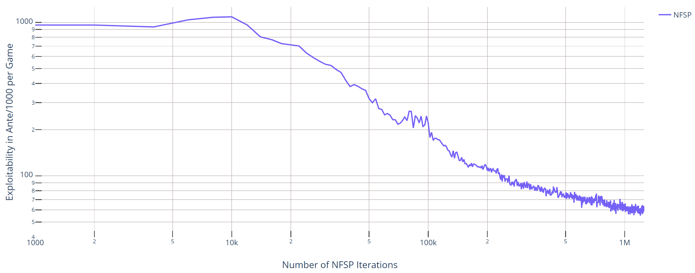

# Neural Fictitious Self-Play 
An implementation of [Neural Fictitous Self-Play](https://arxiv.org/pdf/1603.01121.pdf) [1] in the
[PokerRL](https://github.com/TinkeringCode/PokerRL) framework.

This codebase is designed for:
- Researchers to compare new methods to the NFSP baseline.
- Anyone wanting to learn about Deep RL in imperfect information games.


## Reproducing Results from the NFSP paper [1]
The run-script `NFSP/example_paper.py` launches NFSP in Leduc Hold'em with the same hyperparameters
(but using 3-layer networks) as the original paper [1]. In the run shown, the
100 mA/g (= 0.1A/g from the paper) line is crossed after 230k iterations (4:24hrs) and
the 60 mA/g line after 850k iterations (19hrs). We trained on a single m5.xlarge instance. 
To reproduce, simply run `NFSP/example_paper.py`.



## NFSP on your Local Machine

### Install locally
First, please install Docker and download the [PyCrayon](https://github.com/torrvision/crayon) container. For dependency
management I recommend Miniconda. To install the dependencies, simply activate your conda environment and then run

```
conda install pytorch=0.4.1 -c pytorch -y
pip install PokerRL
```


### Running experiments locally
Before starting NFSP, please spin up the log server by
```
docker run -d -p 8888:8888 -p 8889:8889 --name crayon alband/crayon
docker start crayon
```

You can now view logs at `localhost:8888` in your browser. To run NFSP with custom hyperparameters in any Poker game
supported by PokerRL, build a script similar to `NFSP/example_paper.py`. Run-scripts define the hyperparameters, the game
to be played, and the evaluation metrics. Here is a very minimalistic example:

```
from TrainingProfile import TrainingProfile
from workers.driver.Driver import Driver
from PokerRL import BigLeduc  # or any other game

if __name__ == '__main__':
    ctrl = Driver(    
        t_prof=TrainingProfile(
                name="NFSP_TEST",                                    
                game_cls=BigLeduc,  # -- The game to play       
                lr_br=0.1, # -- Some Hyperparameters
                lr_avg=0.005,
                mini_batch_size_br=128,
                mini_batch_size_avg=128,
            ),
                
        eval_methods={ 
            "br": 2000, # Evaluate Best Response every 2000 iterations
        },
    )

    ctrl.run()
```


## Cloud & Clusters
For deployment on AWS, whether single-core, many-core distributed, or on a cluster, please first follow
the tutorial in the corresponding section of [PokerRL](https://github.com/TinkeringCode/PokerRL)'s README.

We recommend forking this repository so you can write your own scripts but still have remote access through git.
In your run-script set either the `DISTRIBUTED` or the `CLUSTER` option of the TrainingProfile to True
(see e.g. `NFSP/example_distributed.py`).
Moreover, you should specify the number of `LearnerActor` and evaluator workers (if applicable) you want to deploy.
Note that hyperparmeters ending with "_per_la" (e.g. the batch size) are effectively multiplied by the number of
workers. 

When running in DISTRIBUTED mode (i.e. one machine, many cores), simply ssh onto your AWS instance, get your code
onto it (e.g. through git cloning your forked repo) and start your run-script.
To fire up a cluster, define a `.yaml` cluster configuration that properly sets up your workers. Each of them
should have a copy of your forked repo as well as all dependencies on it.
Use `ray up ...` in an ssh session to the head of the cluster to start the job - more detailed instructions about 
the underlying framework we use for distributed computing can be found at [ray](https://github.com/ray-project/ray).


## Citing
If you use this repository in your research, you can cite it by citing PokerRL as follows:
```
@misc{steinberger2019pokerrl,
    author = {Eric Steinberger},
    title = {PokerRL},
    year = {2019},
    publisher = {GitHub},
    journal = {GitHub repository},
    howpublished = {\url{https://github.com/TinkeringCode/PokerRL}},
}
```


## Authors
* **Eric Steinberger**


## License
This project is licensed under the MIT License - see the [LICENSE](LICENSE) file for details.


## References
[1] Heinrich, Johannes, and David Silver. "Deep reinforcement learning from self-play in imperfect-information games."
arXiv preprint arXiv:1603.01121 (2016).
